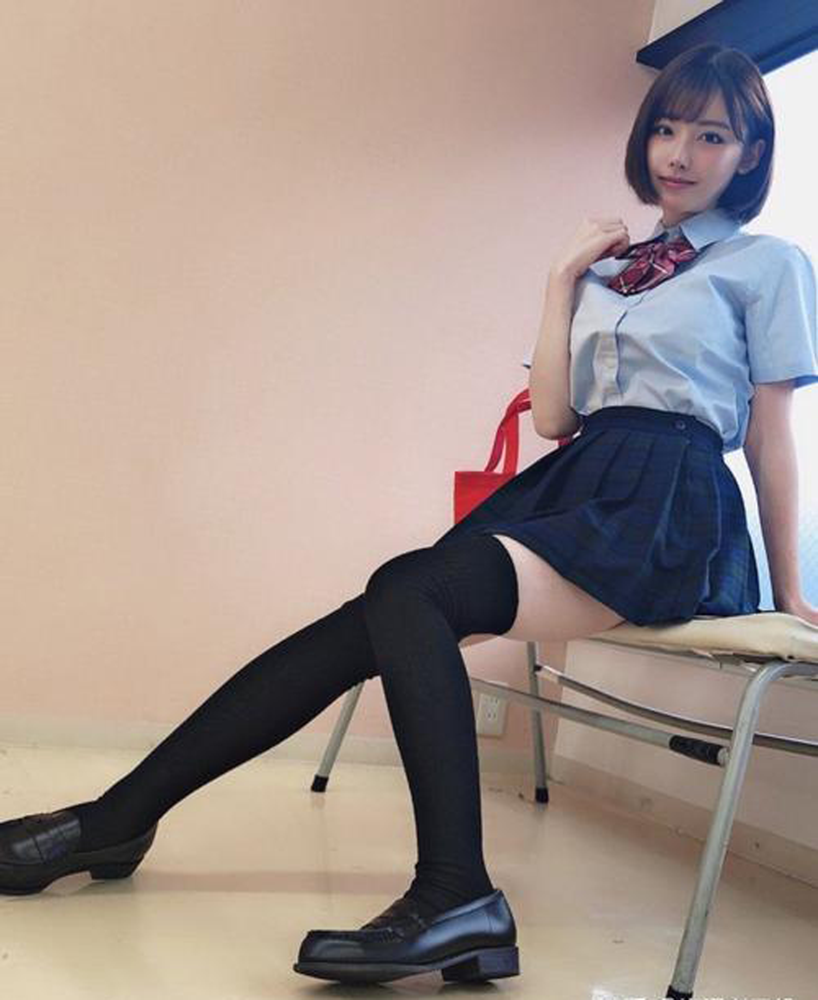
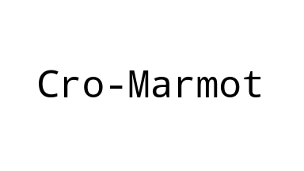
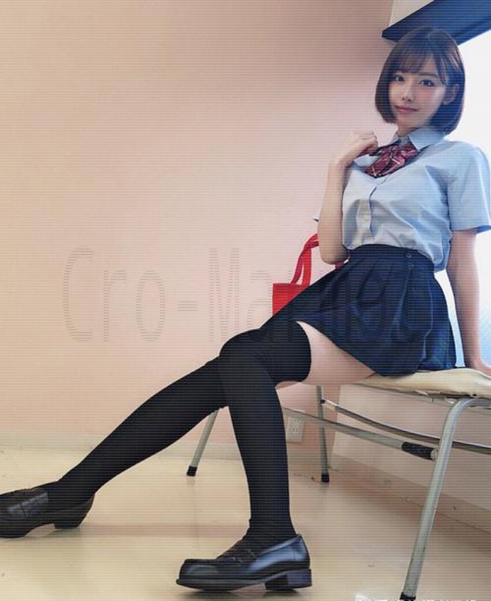

# Usage Demo

## Mix big and small image


`Usage: ./mixbigsmall.py <big_image_path> <small_image_path> <out_image_path>`

```
./mixbigsmall.py big.png small.png mixed.png
```

 +  => 

## extract small from mixed picture

`Usage: ./extract.py <big_image_path> <small width> <small height> <out_image_path>`

```
./extract.py mixed.png 384 216 origin_small.png
```

 => 
